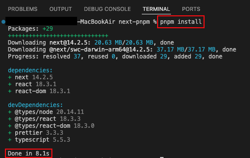
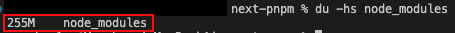
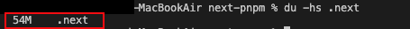
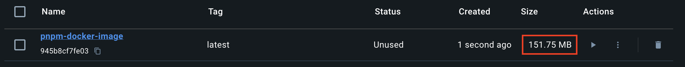
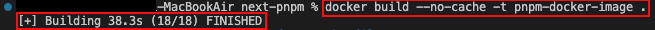
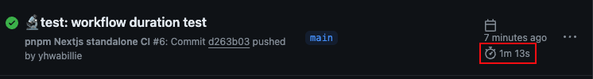
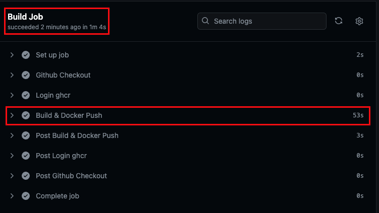

## :memo: Title: next-pnpm
패키지 매니저 pnpm으로 빌드한 NextJS 기본 템플릿입니다.  
최초 빌드를 기준으로 하기위해 workflow 캐시 작업은 제외하였습니다.   
`pnpm store prune` 명령어로 pnpm의 cache를 삭제 후 측정하였습니다.

1) [🏠로컬] Dependency install 시간   

    |결과: `8.1s`|
    |------|
    ||
  

2) [🏠로컬] Dependency 크기   
    |결과: `node_modules: 255M`|
    |------|
    ||
    

3) [🏠로컬] .next 빌드 결과물 크기  
    |결과: `.next: 54M`|
    |------|
    ||   

4) [🐳Docker] 로컬 이미지 크기  
    |결과: `151.75MB`|
    |------|
    ||

5) [🐳Docker] 로컬 이미지 build 시간 
    |결과: `38.3s`|
    |------|
    ||

6) [⚡️Github Actions] CI total workflow 시간 
    |결과: `1m 13s`|
    |------|
    ||

7) [⚡️Github Actions] Build Job 시간 
8) [⚡️Github Actions] Build & Docker Push Step 시간 
    |Build Job 결과: `1m 4s`, Build & Docker Push Step 결과: `53s`|
    |------|
    ||

    :mag: 위 조건들을 기준으로 패키지 매니저별 비교 학습하기 위해 만들었습니다.   
    :mag: 대략적인 수치를 알기 위한 것으로, 오차가 있을 수 있습니다.

## :pushpin: Dev Enviroment
    Node (v20.11.1)  
    PNPM (v.9.5.0)  
    NextJS (v.14.2.5), output: standalone    
    Docker (v.27.0.3)   
    Github Actions (workflow 자동화)

## :pushpin: Dev Dependencies
    prettier (v3)
